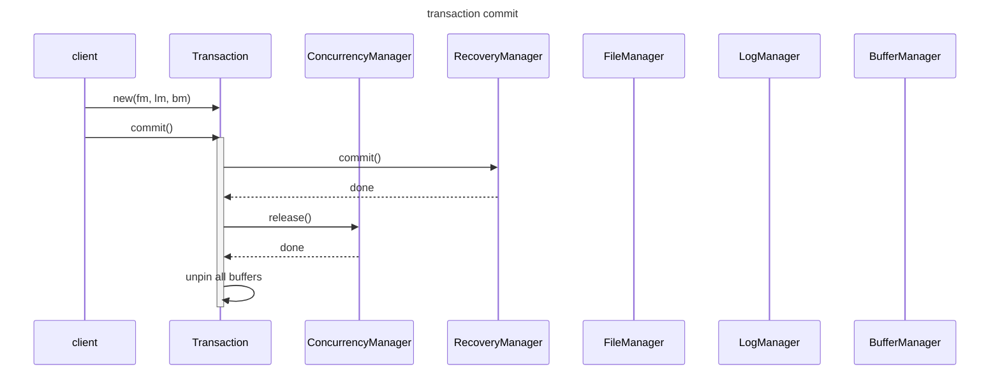

SimpleDB


based on the book [Database Design and Implementation, 2nd edition by Edward Sciore](https://link.springer.com/book/10.1007/978-3-030-33836-7)
and [Phil Eaton's book club](https://eatonphil.com/2024-database-design-and-implementation.html)

### write path

```
seats(flight_id, num_available, price)
cust(cust_id, balance_due)

BEGIN;

COMMIT;
```
 
