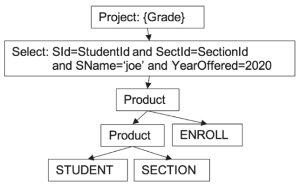

# Query Optimization

### What's bad about basic planning algo?

Calculate the cost of following plans of the same query.
```sql
select grade
from student, `section`, enroll
where sid=studentid and sectid=sectionid
and sname='joe' and yearoffered=2020
```

#### Basic planner query plan
```
56 trillion block accesses. 1ms/block access -> 1780 years to complete query.

How?
    product(student, section) = p1
        45,000 x 25,000 = 1,125,000,000 records
        4500 + (45,000 x 2500) = 112,504,500 block accesses.
    product(p1, enroll)
        B(p1) + R(p1) x R(enroll)
        112,504,500 + 1,125,000,000 x 50,000 = 56.25 trillion
```



#### Optimized query tree
```
Assuming there is one student named Joe.
139,500 block accesses -> 2.3 minutes to complete

How?
    select(student): 4500 blocks, output 1 (joe)
    join(joe, enroll): 1 x 50000 blocks of enroll, output 34
    join(secid=sectionid): 34 x 2500 = 85000 blocks
    total = 4500 + 50000 + 85000 = 139,500 blocks
```


#### Further optimization if index


Cost formulas
```
Product(A,B) = blocks(AxB) = B(A) + R(A) x R(B)
scan A once, for each record of A, rescan all blocks of B
```

Statistics to calculate
- `B(T)` num blocks used by each table T
- `R(T)` num records each table T
- `V(T,F)` num distinct values of col F in T

