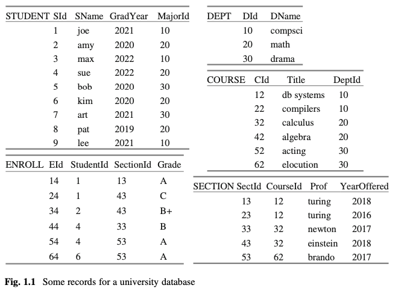
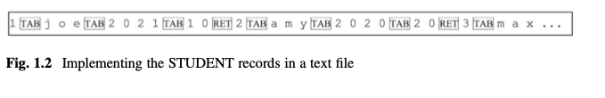

# chap 1 database systems

contents
- issues db system must tackle
- capabilities db system expected to have
- [Derby](https://db.apache.org/derby/) and SimpleDB db systems intro





why is storing students in a text file bad?
1. large text files take too long to update -> local rewrites only, not whole file
2. large text files take too long to read -> indexes

Nice analogy: `getting cookies`
- RAM        ==> from kitchen: 5s
- flash disk ==> from store: 5000s (1 hour)
- spin disk  ==> from mail: 500,000s (5 days)

### usability

query language power compare to code
```sql
select SName from STUDENT where GradYear = 2019
```

using java scanning entire file to look for students of 2019
```java
public static List<String> getStudents2019() { 
  List<String> result = new ArrayList<>(); 
  FileReader rdr = new FileReader("students.txt"); 
  BufferedReader br = new BufferedReader(rdr); String line = br.readLine();
  while (line != null) {
    String[] vals = line.split("\t"); String gradyear = vals[2];
    if (gradyear.equals("2019"))
      result.add(vals[1]);
    line = br.readLine();
   }
   return result;
}
```

### db system typical features
1. storage
   1. ability to store records in a file, 
   2. using a format that can be accessed more efficiently than the file system typically allows
2. indexing: alsos for indexing data, supporting fast access
3. concurrency handling: ability to handle concurrent accesses from multiple users over a network, blocking users when necessary.
4. transaction and recovery: Support for committing and rolling back changes
5. consistency
   1. ability to cache database records in main memory 
   2. and to manage the synchronization between the persistent and main-memory versions of the database
   3. restoring the database to a reasonable state if the system crashes
6. front-end language compiler/ intepreter
   1. translating user queries on tables to executable code on files
7. query optimization

connections to db engine
1. client-server
2. embedded
