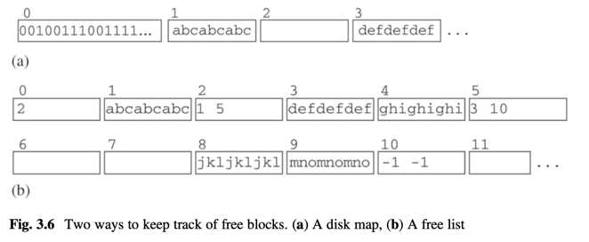
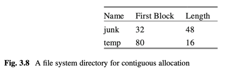
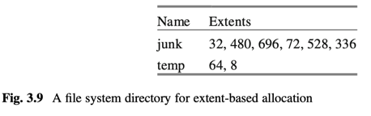

# 3 Disk and File Management

contents
- look at properties of storage devices (disks, flash drives)
- look at techniques improving speed and reliability (i.e. RAID)
- 2 interfaces OS provides to interact with storage device
  1. block-level interface
  2. file-level interface
- how databases use both interfaces
- simpledb file manager API and impl in detail

## 3.1 persistent data storage

## 3.2 block interface

- different disks has different sector size
- block == sector whose size determined by OS
- OS maintains mapping btw block and sector
- block same fixed size for all disks

OS block api
``` 
readblock(n, p) 
    reads bytes at block n of disk into page p of mem

writeblock(n, p) 
    writes bytes from page p of mem to block n of disk

allocate(k, n) 
    finds k contiguous unused blocks on disk, marks them as used, 
    and returns the block number of the first one. 
    The new blocks should be located as close to block n as possible.
    
deallocate(k,n) 
    marks the k contiguous blocks starting with block n as unused.
```



## 3.3 file-level interface





using file system interface to disk
```java 
RandomAccessFile f = new RandomAccessFile("junk", "rws");
f.seek(7992);
int n = f.readInt();
f.seek(7992);
f.writeInt(n+1);
f.close();
```

## 3.4 db system and os

block api
- pros
- cons
  - complex to implement
  - dba knows about blocks

file api
- pros
  - easier to implement
  - allows OS to hide disk access from db
- cons
  - db does not know block boundaries
  - db cannot manage its own pages

OS way of managing I/O buffers is not suitable for db queries.

## 3.5 simpledb file manager

structure
- simpledb is stored in several files.
  - a file for each table, index.
  - a log file
  - several catalog files
- file manager 
  - provides block level access to those files.
  - in package `simpledb.file`

API for SimpleDB file manager

```
BlockId
    public BlockId(String filename, int blknum);
    public String filename();
    publick int number();

// Page holds content of a disk block.
// each page is implemented using Java ByteBuffer which wraps
// a byte array with methods to read and write values randomly.
Page
    public Page(int blocksize);
    public Page(byte[] b);
    public int getInt(int offset);
    public String getString(int offset);
    public void setInt(int offset, int val);
    public void setBytes(int offset, byte[] val);
    public void setString(int offset, String val);
    public int maxLength(int strlen);

// read and write pages to disk block
FileMgr
    public FileMgr(String dbDirectory, int blocksize);
    public void read(BlockId blk, Page p);
    public void write(BlockId blk, Page p);
    public BlockId append(String filename);
    public boolean isNew();
    public int length(String filename);
    public int blockSize();
```

