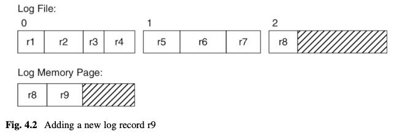

## Questions

1. what happens in db like SQLite, Postgres, MySQL if log record is bigger than a page?
2. if log manager does not flush new records immediately, how to ensure transation durability?
3. file disk block can have blank space as log record sizes vary and do not fit 100% in a page. What typically happens in common commercialized databases? Are the blanks just left as-is?
4. is writing a file block == a page to disk by `LogManager`, `BufferManager` atomic? It must be to ensure data consistency, what if it's not?
5. Give one example of why `buffer manager` must wait for all a page `related log records` written to disk by `log manager` before it can write a `modified data page` to disk.

---

### Log Manager

Log records can have varying sizes: 
- four records fit into block 0 
- but only three fit into block 1

Block 2 is not yet full and contains just one record r8. 

memory page
- contains the contents of block 2
- and an newly appended log record r9

