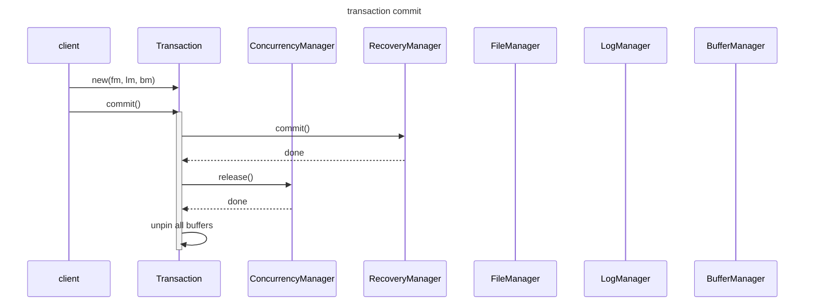

# Chapter 5 Transaction Management

`Transaction`
- list of operations that behave like one
- ensures ACID

`RecoveryManager`
- each transaction has its own recovery manager
- responsible for ensuring `Atomicity` and `Durability` in ACID by 
  1. writing suitable log records for parent transaction based on operation (see log record types below)
  2. implementing transaction rollback (reading log backwards, using update records to undo modifications)
  3. implementing recovery algo (after a crash)
- recovery algos
  1. undo-redo
  2. undo-only
  3. redo-only
- uses `undo-only recovery` with `value-granularity` data items
- note
  - recovery is idempotent
  - recovery can cause more disk writes than necessary
- A recovery manager can choose to log values, records, pages, files, etc. The unit of logging is called a recovery data item. The choice of data item involves a trade-off: A large-granularity data item will require fewer update log records, but each log record will be larger.

> why "if undo-redo (or redo-only) recovery is used, then the recovery manager must flush modified buffers to disk before it writes a checkpoint record?"

`write-ahead logging`
- required update (set) log record to be flushed to disk before modifying data page.
- guarantees that db mutations will always be in the log and therefore always `undoable`.

`LogRecord`: store
1. StartRecord: written when a txn begins
2. SetIntRecord: written when a txn modifies value
3. SetStringRecord: written when a txn modifies value
4. CheckpointRecord: written to reduce log portion that recovery algo needs to traverse
5. CommitRecord
6. RollbackRecord

`Checkpoint`
- why? to reduce how much of the log we need to scan in recovery (until checkpoint instead of until start of log)
- `quiescent` checkpoint record can be written when no transactions running
  - pros: simple to implement. easy to understand
  - cons: db unavailable when recovery manager waits for existing txn to complete
- `nonquiescent` checkpoint record can be written at any time.
- If undo-redo (or redo-only) recovery is used, then the recovery manager must flush modified buffers to disk before it writes a checkpoint record.

`ConcurrenyManager`
- responsible for correct execution of concurrent transactions.
- each `Transaction` has its own `Concurrency Manager` to manage concurrency
- lock table is shared amongst all concurrency managers.
- `schedule`
  - schedule = sequence of operations performed by the transactions in the engine
  - A schedule is `serializable` if it is equivalent to a serial schedule. 
  - Only serializable schedules are `correct`.
- how simpledb ensure serializable schedule? pessimistic concurrency control using lock protocol `LockTable`
- lock protocol
  - Before reading a block, acquire a shared lock on it.
  - Before modifying a block, acquire an exclusive lock on it.
  - Release all locks after commit or rollback.
- `deadlock`
  - reason: transactions cycle
  - waits-for graph
  - cycle detection algo
  - wait-die algo
  - time-limit algo
- `phamtoms`
- reduce waiting time in locking
  - multiversion locking
  - removing serializability requirement. isolation levels
    1. serializable
    2. repeatable read
    3. read committed
    4. read uncommitted
- `concurrency data item` = unit of locking. what to lock options:
  - values
  - records
  - pages
  - files
  - etc.

> What happens if client-1 has a shared lock for read and client-2 wants an exclusive lock for write?


### Why need transaction management?
- because buffer manager allows multiple clients to read, write it concurrently.
- this leads to violation of ACID properties
  - Isolation: a client can see other client modifications in the same buffered page.
  - Consistency: client-1 reads a value in a page, does some computation. If the value is updated in the buffered page by client-2, the original value client-1 is using might not be valid anymore. client-1 does not have a consistent view of that value.
- so we have concurrency manager to
  - implement locking or MVCC on buffered page.
  - put each client change ops in a transaction.
  - determine how to execute the transactions and their operations to ensure ACID.
- have recovery manager to
  - undo changes of rollback txn or uncommitted txn after crash.
  - redo committed txn ops after crash in those are not in db files yet.

### write path

```
seats(flight_id, num_available, price)
cust(cust_id, balance_due)

BEGIN;

COMMIT;
```



### On Isolation

- `snapshot isolation`
  - more efficient than locking protocol
  - but does not guarantee `serializability`
