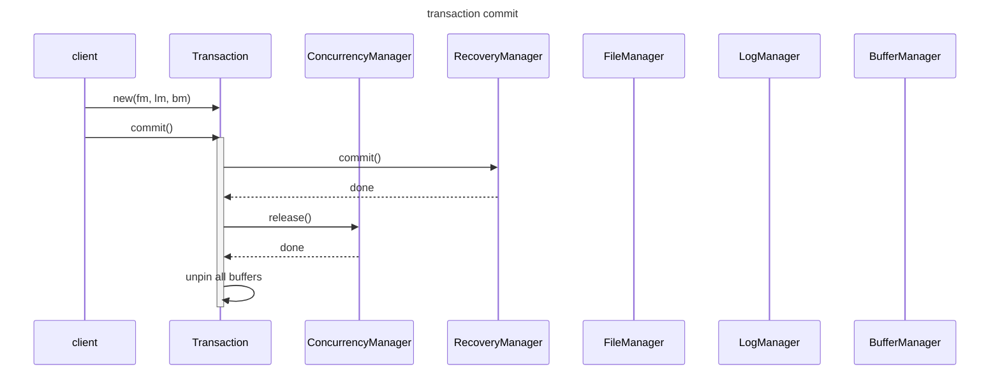

# Chapter 5 Transaction Management

`Transaction`

`RecoveryManager`

`ConcurrenyManager`
- each `Transaction` has its own `Concurrency Manager` to manage concurrency
- pessimistic concurrency control using lock protocol `LockTable`
- lock table is shared amongst all concurrency managers.

### write path

```
seats(flight_id, num_available, price)
cust(cust_id, balance_due)

BEGIN;

COMMIT;
```

