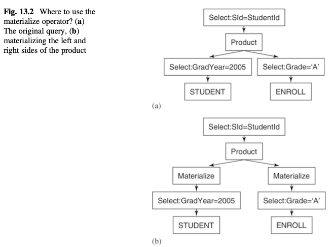
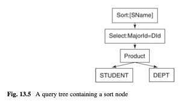

# Chapter 13: Materialization and Sorting

- relational algebra operators
  - materialize
  - sort
  - groupby
  - mergejoin
- materialization implementation of an operator
- materialize operator
  - temp table
  - input records
  - no recomputation
  - more efficient than only pipelined operators
- external sorting algo
  - temp table
  - mergesort
- mergesort
  - staging area
- groupby
- mergejoin algo


```java 
class TempTable


interface Plan

class MaterializePlan implements Plan

class SortPlan implements Plan
class SortScan implements Scan 

class GroupByPlan implements Plan 
class GroupByScan implements Scan 
class GroupValue
interface AggregationFn
class MaxFn implements AggregationFn

class MergeJoinPlan implements Plan
class MergeJoinScan implements Scan 

```




