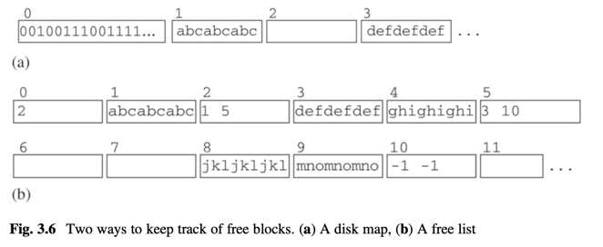
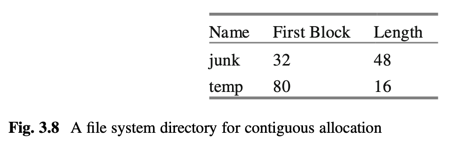
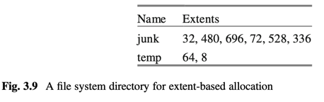

# 3 Disk and File Management

contents
- look at properties of storage devices (disks, flash drives)
- look at techniques improving speed and reliability (i.e. RAID)
- 2 interfaces OS provides to interact with storage device
  1. block-level interface
  2. file-level interface
- how databases use both interfaces
  - good and common compromise: store data in files, access files at block level.
- simpledb file manager API and impl in detail

summary
- how many stages for disk access?
  1. seek time
  2. rotational delay
  3. transfer time
- how to improve access time? disk caches, cylinders, disk striping.

#### RAID

- how to improve disk reliability? RAID
  - RAID 0
  - RAID 1
  - RAID 4
- `controller`
  - an abstraction layer for the OS to see only a virtual single disk
  - controller maps virtual read/write op -> one or more ops on RAID disks.

### OS block interface
- why? hide details of disk and flash drive from OS clients by providing `block-based interface`
- how?
  - block == similar to physical disk sector. # is size determined by OS
  - clients access content by block number, see apis.
  - different disks has different sector size 
  - OS maintains mapping btw block and sector 
  - OS keeps track of which block ares free by `disk map` or `free list`
  - block same fixed size for all disks
- `page`
  - **page is a block-sized area of memory**
  - client changes block on disk by
    - read disk block to mem as page
    - change page
    - write page back to disk block

OS block api
``` 
readblock(n, p) 
    reads bytes at block n of disk into page p of mem

writeblock(n, p) 
    writes bytes from page p of mem to block n of disk

allocate(k, n) 
    finds k contiguous unused blocks on disk, marks them as used, 
    and returns the block number of the first one. 
    The new blocks should be located as close to block n as possible.
    
deallocate(k,n) 
    marks the k contiguous blocks starting with block n as unused.
```



### file-level interface
- another interface besides `block interface`
- OS clients see file as `named sequence of bytes`, can read/write any num of bytes starting at any pos in file.
- no notion of block at this level.
- 3 ways OS implement files
  1. contiguous allocation
  2. extent-based allocation
  3. indexed allocation





java file api
```java 
RandomAccessFile f = new RandomAccessFile("junk", "rws");
f.seek(7992);
int n = f.readInt();
f.seek(7992);
f.writeInt(n+1);
f.close();
```

rust file api


## db system and os

block api
- pros
- cons
  - complex to implement
  - dba knows about blocks

file api
- pros
  - easier to implement
  - allows OS to hide disk access from db
- cons
  - db does not know block boundaries
  - db cannot manage its own pages

OS way of managing I/O buffers is not suitable for db queries.

## simpledb file manager

structure
- simpledb is stored in several files.
  - a file for each table, index.
  - a log file
  - several catalog files
- file manager 
  - provides block level access to those files.
  - in package `simpledb.file`

API for SimpleDB file manager

```
BlockId
    public BlockId(String filename, int blknum);
    public String filename();
    publick int number();

// Page holds content of a disk block.
// each page is implemented using Java ByteBuffer which wraps
// a byte array with methods to read and write values randomly.
Page
    public Page(int blocksize);
    public Page(byte[] b);
    public int getInt(int offset);
    public String getString(int offset);
    public void setInt(int offset, int val);
    public void setBytes(int offset, byte[] val);
    public void setString(int offset, String val);
    public int maxLength(int strlen);

// read and write pages to disk block
FileMgr
    public FileMgr(String dbDirectory, int blocksize);
    public void read(BlockId blk, Page p);
    public void write(BlockId blk, Page p);
    public BlockId append(String filename);
    public boolean isNew();
    public int length(String filename);
    public int blockSize();
```

