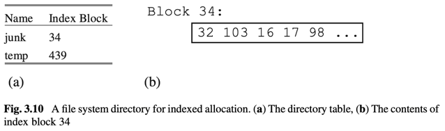

## 3.12 Indexed File Allocation

Consider a `file implementation` that uses `indexed file allocation`. Assuming that the block size is 4K bytes, what is the size of the largest possible file?

Index Allocation
- each file block is allocated individually
- pros: no fragmentation as blocks are allocated one at a time.
- cons: files have max size as they can have as many blocks as there are values in index block.

## 3.15
A database system often contains diagnostic routines.
1. Modify the class `FileMgr` so that it keeps useful statistics, such as the number of blocks read/written.
2. Add new method(s) to the class that will return these statistics.
3. Modify the methods `commit` and `rollback` of the class `RemoteConnectionImpl` (in the `simpledb.jdbc.network` package) so that they print these statistics.
4. Do the same for the class `EmbeddedConnection` (in the `simpledb.jdbc.embedded` package).

The result will be that the engine prints the statistics for each SQL statement it executes

## 3.16

## 3.17
