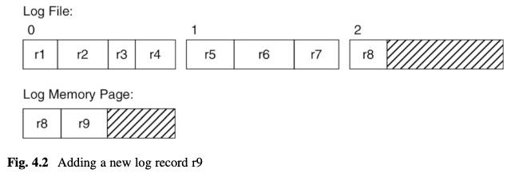

## Questions

__log manager__

1. what happens in db like SQLite, Postgres, MySQL if log record is bigger than a page?
2. if log manager does not flush new records immediately, how to ensure transation durability?
3. file disk block can have blank space as log record sizes vary and do not fit 100% in a page. What typically happens in common commercialized databases? Are the blanks just left as-is?
4. is writing a file block == a page to disk by `LogManager`, `BufferManager` atomic? It must be to ensure data consistency, what if it's not?
5. Give one example of why `buffer manager` must wait for all a page `related log records` written to disk by `log manager` before it can write a `modified data page` to disk.

__buffer manager__

1. why is a page not flushed immediately after unpinned by waiting until it's replaced with a new block?
Quoting page 89 `Second, if the selected page has been modified, then the buffer manager must write the page contents to disk; this action is called flushing the page.`

2. why `Buffer` has to ensure log record is written to disk first before writing the page to disk?
```java
void flush() {
    if (txnum >= 0) {
        lm.flush(lsn); 
        fm.write(blk, contents); 
        txnum = -1;
    } 
}
```


---

### Log Manager



Log records can have varying sizes: 
- four records fit into block 0 
- but only three fit into block 1

Block 2 is not yet full and contains just one record r8. 

memory page
- contains the contents of block 2
- and an newly appended log record r9

### Buffer Manager

wait list
- Suppose that the database engine has a lot of clients, all of whom are using a lot of buffers. It is possible for every buffer page to be pinned. In this case, the buffer manager cannot immediately satisfy a pin request. Instead, it places the client on a wait list. When a buffer becomes available, the buffer manager takes the client off the wait list so that it can complete the pin request. In other words, the client will not be aware of the buffer contention; the client will only notice that the engine seems to have slowed down.
- deadlock: 2 clients waiting on the wait list for each other forever.
- simpledb solution
  - keeping track of how long client has been waiting for a buffer
  - if more than a threshold like 10s, assuming deadlock, throwing an exception `BufferAbortException`
  - client to handle exception e.g. retry transaction
