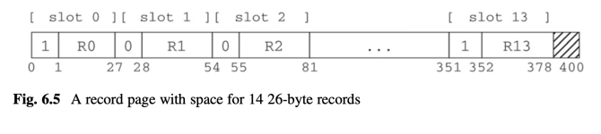

# 6 - Record Management


why?
- encode and decode what values are in a binary disk block.
- works at the record abstract level
  - how to iterate through the records
  - how to insert, update values in record

what is record manager responsible for?
1. how to store fields in records 
2. how to store records in blocks 
3. how to access records in a file

questions to address when designing a `record manager`
1. `spanned vs unspanned`: each record be placed entirely within one block?
2. `homogeneous vs non file`: all records in a block be from the same table?
3. `fixed- vs variable-length`: is each field representable using a predetermined number of bytes?
4. `field placing`: where should each field value be positioned within its record?

issues and solutions
1. variable-length fields, records -> `overflow block`, `ID table`
2. spanned records? -> trade-off between reducing storage waste and implementation complexity
3. non-homogeneous records -> `clustered` records -> efficient join, `tag field` -> record, table mapping
4. how to determine field offset in record -> byte padding or search


implementing a file of records
1. simple impl
2. var-length fields
3. spanned records
4. non-homogeneous records



SimpleDB API for record management
- record page
- file of record pages
- managing record info: 
  - `Schema` for logical (fieldname, type, length)
  - `Layout` for physical (field size, slot size, offset,...)
- managing records in a page (block of records)
  - `RecordPage`
  - empty/ inuse flags are 4-byte ints (SimpleDB does not support byte-sized values)
- managing multiple records in many pages in a file
  - `TableScan`

```
Schema

Layout

TableScan
    public TableScan(Transaction tx, String tblname, Layout layout);
    
    public void close();
    public boolean hasField(String fieldname);
    
    // methods to establish the current record
    public void     beforeFirst();
    public boolean  next();
    public void     moveToRid(RID r);
    public void     insert();
    
    // methods to access current record
    public int    getInt(String fieldname);
    public String getString(String fieldname);
    public void   setInt(String fieldname, int val);
    public void   setString(String fieldname, String val);
    public RID    currentRid();
    public void   delete();

RID
```

Schema and Layout usage

```java
Schema schema = new Schema();
schema.addIntField("course_id");
schema.addStringField("title", 20);
schema.addIntField("dept_id");
Layout layout = new Layout(schema);

for (String fieldname: layout.schema().fields()) {
    int offset = layout.offset(fieldname);
    System.out.println(fieldname + " has offset " + offset);
}
```