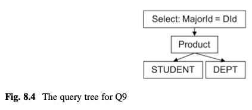

# Chapter 8: Query Processing


- relational algebra ~ set of data-retrieval operators
- operator
  - 1 task
  - operator(input tables) -> 1 output table
- main operators
  - select
  - project
  - product
- scan
  - = output of a relational algebra query = 1 virtual table
  - scan object = one node of query tree
  - updatable scan
  - operator intent
- query tree
  - built by composing scans
  - query defines virtual table
- pipelined query processing
  - definition: operators having the following behaviors are pipelined
    - output records generated one at a time, as needed.
    - do not save output records, do not save any intermediate computation.
  - need-to-know
  - pipelined scan does not keep track of records it has selected.
  - not preprocess data, read ahead, cache, sort
  - not construct output records
- predicate
  - term
  - expression
  - constant

```java
interface Scan
  void      beforeFirst()
  boolean   next()
  int       getInt(String fieldname)
  String    getString(String fieldname)
  Constant  getVal(String fieldname)
  boolean   hasField(String fieldname)
  void      close()
    
interface UpdateScan extends Scan
  void setInt(String fldname, int val)
  void setString(String fldname, String val)
  void setVal(String fldname, Constant val)
  void insert()
  void delete()
  RID  getRid()
  void moveToRid(RID rid)

// one scan class for each relation operator ~ internal node of query tree.
class SelectScan(Scan s, Predicate pred) implements UpdateScan
class ProjectScan(Scan s, List<String> fieldNames) implements Scan
class ProductScan implements Scan
// TableScan is the leaf node of the tree.
class TableScan(Transaction tx, String filename, Layout layout) implements UpdateScan

class Constant implements Comparable<Constant>
class Expression
class Term
class Predicate
  void conjoinWith(Predicate pred)
  boolean isSatisfied(Scan s)
```

reading through scan
```java
public static void printNameAndGradyear(Scan s) {
  s.beforeFirst();
  while (s.next()) {
    String studentName = s.getString("sname");
    String gradYear = s.getInt("gradyear");
    System.out.println(studentName + "\t" + gradYear);
  }
  s.close();
}
```

predicate code
```java
Expression left = new Expression("StudentName");
Constant c = new Constant("joe");
Expression right = new Expression(c);
Term t1 = new Term(left, right);

Expression left2 = new Expression("MajorId");
Expression right2 = new Expression("DepartmentId");
Term t2 = new Term(left2, right2);

Predicate pred1 = new Predicate(t1);
Predicate pred2 = new Predicate(t2);
pred1.conjoinWith(pred2);
```




code for query tree Fig8.4
```java
Transaction tx = db.newTx();
MetadataMgr mdm = db.MetadataMgr();
// student node
Layout layout1 = mdm.getLayout("student", tx); // why mdm needs txn for layout?
Scan s1 = new TableScan(tx, "student", layout1);
// the DEPT node
Layout layout2 = mdm.getLayout("dept", tx); 
Scan s2 = new TableScan(tx, "dept", layout2);
// the Product node
Scan s3 = new ProductScan(s1, s2);
// the Select node
Predicate pred = new Predicate(. . .); //majorid=did 
Scan s4 = new SelectScan(s3, pred);
// printing output
while (s4.next()) 
    System.out. println(
        s4.getString("sname") +
        ", " + s4.getString("gradyear") +
        ", " + s4.getString("dname")
  );
s4.close();
```

draw an image of this hierarchy
- TableScan
  - record page
    - buffer
      - page containing current record (== location in that page)

further readings
1. Atzeni, P., & DeAntonellis, V. (1992). *Relational database theory*. Upper Saddle River, NJ: Prentice-Hall.
2. Chaudhuri, S. (1998). *An overview of query optimization in relational systems*. In Proceedings of the ACM Principles of Database Systems Conference (pp. 34–43).
3. Graefe, G. (1993). *Query evaluation techniques for large databases*. ACM Computing Surveys, 25(2), 73–170.
